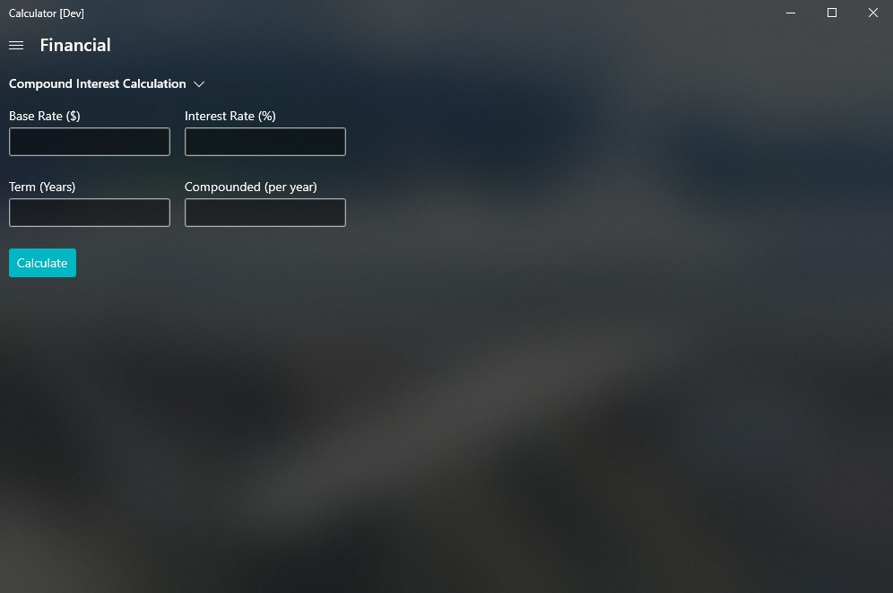
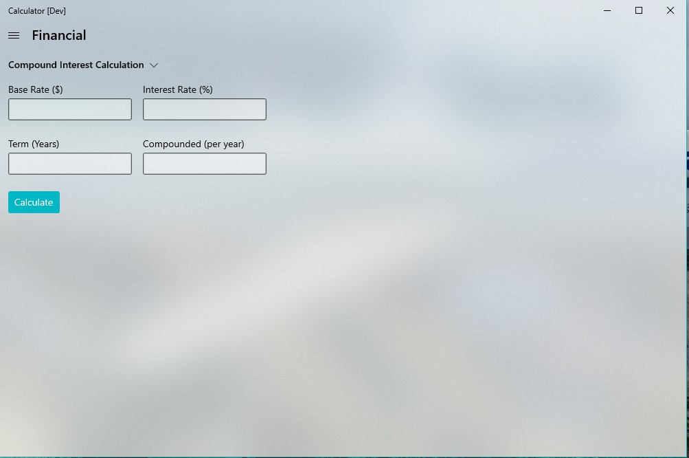

### Financial Calculator
<!-- Update with a concise title describing your feature. -->

### Feature Pitch Link
https://github.com/Microsoft/calculator/issues/806

### Problem Statement
This will create a new calculation mode, "Financial". It will be similar to the date calculator with a combobox at the top to choose modes (current modes are Tip and Compound Interest). Target audience: Anyone with financial assets to people going out for lunch.

### Evidence or User Insights
We should do this to offer more tools to calculator users and make this a more feature-packed calculator (GitHub issue: #806)

### Proposal
Create a new feature "Financial". With it, we can target investors and even students learning about financial responsibility.

### Goals and Non-Goals
## Goals
* Create a compound interest calculator
* Tips calculator

## Non-Goals
* Even more modes

### Success Criteria
Sucess can be mesured with users, and engagement time.

### Feature Requirements
* Users can input Base Rate, term, times compounded, and interest rate to get the future rate.
* Users can input the bill amout, tip percentage and if they want to split the bill (and if yes, between how many people) and recieve the result.

### Feature Details and High-Fidelity Concept
## Dark mode

The compound calculation page...

Navbar...

## High-contrast

The compound calculation page (button seems that it needs tweaking)...

Navbar...

## Light mode

The compound calculation page...

Navbar...

_Tips calculator page images to be out soon_

We can look at the [numberbox](https://github.com/microsoft/microsoft-ui-xaml-specs/blob/master/active/NumberBox/NumberBox.md#:~:text=Xaml%20has%20a%20TextBox%20control%20for%20text%20input%2C,not%20as%20part%20of%20the%20Windows%20OS.%20Description) from the XAML team (it dosen't come as part of Windows OS).

### Appendix
Phases:
Look at devoloping more modes later on.

Risks and Open Issues:
Open issue: I think the everything is up for discussion. 
Risks: I don't think there are.

Note: These are the earliest iterations of the calc and is _subject to change_.