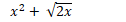

## Equation Input Area

The equation inptu area is comprised of:

- A list of equation input boxes, each of which supports
  - Ability to input/edit a math equation
  - Ability to toggle visibility of the equation
  - Ability to analzye the equation for key graph features (e.g., zeroes, intercepts, etc.)
  - Ability to customize the style of the line
  - Ability to delete the equation from the list
- A list of global variables that have been used in equations that can be manipulated live to understand how changes impact plots
- A button to add a new equation to the list

> Note: Style options in comp are slightly out-of-date; see below for more details.

#### Equation Input Area Requirements

##### 1) User can enter an equation with 1 or 2 variables (x, y)

An equation is an expression through an equality (e.g., =) between the two algebraic quantities or a set of quantity. We will officially support the following equation types at launch:

* Linear
* Quadratic 
* Polynomial
* Trigonometric
* Radical
* Exponential
* Inequality
* Conics/circles

##### 2) Equations are displayed in rich MathML styling format

Mathematical Markup Language (MathML) is a low-level specification for mathematical and scientific content on the Web and beyond ([source](https://www.w3.org/Math/)). MathML or "pretty math" ensures that we are rendering math expressions in the same way that you might write the equation on a whiteboard.

In other calculator modes, we currently render _linear_ input. If we did this in graphing mode, expressions would be represented like this:

x ^ 2 + √(2x)

instead of this:

##### 3) Users can input their equations with freeform input

In other calculator modes, when you input an expression, you are comitting previous input with each operator, which means that you cannot easily edit or undo what you have already comitted. We also have a key mapping such that keyboard keys are mapped to specific button inputs. This means that to enter "cos()", you actually press <kbd>o</kbd>. This is unintuitive and makes entering equations difficult.

For graphing mode, we will support freeform input, which means that users can place the cursor anywhere inside of an equation input box to edit the expression. This also means that users can type or paste in "cos(x)", which feels natural, as this is how you would write this expression up on a whiteboard.

##### 4) User can toggle the visibility of an equation

##### 5) Users can change the color and style of equation lines

##### 6) Users can manipulate a variable within an equation to see the effect it has on the graph

#### Detailed Visual States

> TODO: Annotate visual states

