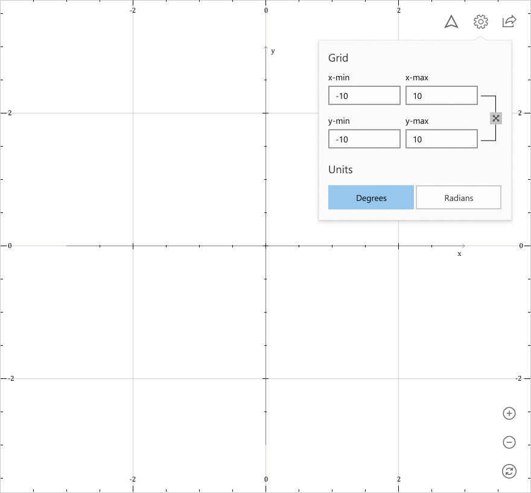
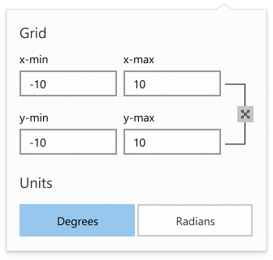

## Graphing Area

The graphing area is comprised of:

* Graphing engine output, which renders equation plots
* Button grouping in the bottom-right corner to allow for manipulation of graph surface:
  * Zoom in/out
  * Reset to best view
* Button group in the top-right corner which surfaces the following functionality:
  * Enter/exit active tracing
  * Global graph settings (e.g., specify x-min/x-max)
  * Share

> Note: Graph styling in comp is slightly out-of-date; tick mark values should appear along each axis instead of along the border. Also, degrees and radians buttons should be swapped.

#### Graphing Area Requirements

##### 1) User can change the viewing window by dragging and zooming the graphing area

The graphing surface viewing area can be manipulated by users with pointer input, similar to exploring a map. This includes support for panning and zooming gestures and pointer interactions:

* **Panning**: Users can click or tap and drag to pan the graphing surface.
* **Zooming**:  Users can pinch-to-zoom (touch) or use the scroll wheel (mouse) to zoom in and out of the  the graphing surface.

> Open Question: Should we support keyboard shortcuts (e.g., "Ctrl + Plus" to zoom in, arrow keys to pan, etc.)

##### 2) User can zoom the viewing window via onscreen buttons

For a more accessible experience, we will support on-screen zoom buttons for improved keyboard input.

> Note: Final font glyph assets for zoom buttons are subject to change

##### 3) User can reset the viewing window to "best fit" via onscreen buttons

The graphing engine automatically returns a "best fit" graph view window. If the user changes the view, this button will allow the user to instantly reset to that "best fit" view.

>  Note: Final font glyph assets for "best fit" button is subject to change

##### 4) User can export the graph to other applications

When exporting the graph, we will generate an image made up of the current graph viewing with the list of equations rendered underneath the graph as a key.

> TODO: Missing design asset

##### 5) User can save the graph as an image

In addition to sharing with other applications, the user should be able to save the image to disk. Supported filetypes include .png, .jpg, .jpeg, and .svg. The default file name should be prefixed with "graph".

##### 6) Users can change the min and max x/y values for the graph window.

Users can manually specify the min and max values for x and y coordinates. A "lock aspect ratio" button allows users to quickly change these values while optimizing for a square graph area (e.g., -15 to 15).

The default changes based on what equations are being plotted and is determined based on the generated "best fit" graph output from the graphing engine.

> Note: Final font glyph assets for locking aspect ratio button is subject to change

> Open Question: Is "lock aspect ratio" useful accelerator or should it be removed for simplicity?

##### 7) Users can switch between operating in degrees and radians.

When users toggle between degrees and radians, this affects all plots, as it is a global setting. The default is reset to radians upon starting a new graphing session.

##### 8) The x and y intercepts are highlighted on the graph

X- and y-intercepts are highlighted on the graph by default for each plot.

> TODO: Missing design asset
