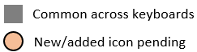
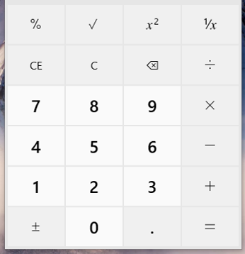
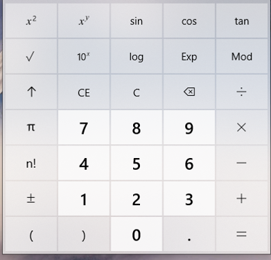
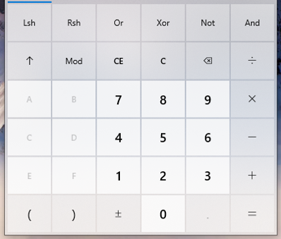
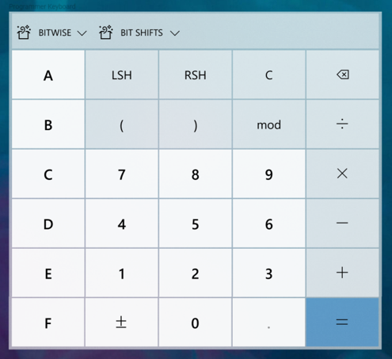
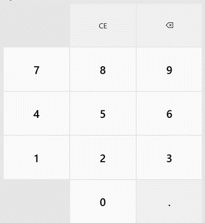
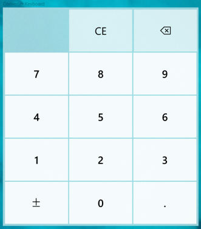

## Update Calculator keyboard for greater consistency and extensibility

### Problem Statement
The Calculator keyboard requires some changes to meet the demands of upcoming features, including graphing mode and always-on-top mode. Furthermore, the current standard keyboard could be better at accommodating scaled screen sizes, which improves overall accessibility of the app. There are a number of other problems this spec seeks to address, including reducing confusion over the up arrow used as the shift key and reducing the number of keyboard layout states.

### Evidence or User Insights
The current keyboard is not scalable to support new minimum size requirements for CompactOverlay mode, nor is it extensible to support additional functionality in graphing calculator.

### Proposal
Update they keyboard app-wide for increased consistency and greater extensibility to prepare for upcoming feature improvements.

### Goals and Non-Goals
**Goals**
* No functionality takebacks in existing calculator modes
* Opportunistically add missing functionality across modes
* Increase clarity around shifted operations

**Non-Goals**
* Changes to display option buttons are out of scope (e.g., BYTE/WORD mode in programmer calculator), unless the button is better suited to be included in the keyboard

### Success Criteria
Success here is unblocking future feature development and improving overall accessibility.

### Feature Requirements
| Priority | Requirement |
|:-:|:-|
| P1 | Keyboard in Standard mode is updated to new layout and styling |
| P1 | Keyboard in Scientific mode is updated to new layout and styling |
| P1 | Keyboard in Programmer mode is updated to new layout and styling |
| P1 | Keyboard in Converters are updated to new layout and styling |
| P1 | Create new Operator Overflow Panel and operator groupings |
| P1 | Calculator font updated with new/updated icons to support keyboard changes |
| P2 | Add support for X-Y focus keyboard navigation using arrow keys |
| P2 | Keyboard in Graphing Mode added with new layout and styling |

### Feature Details and High-Fidelity Concept

_**Note:** Strings and icons below are not final._

#### Standard Mode
|||
|:-:|:-:|
| Before | After |

#### Scientific Mode
|||
|:-:|:-:|
| Before | After |

#### Programmer Mode
|||
|:-:|:-:|
| Before | After |

#### Converters
|||
|:-:|:-:|
| Before | After |

#### Graphing Mode (_new_)

### Appendix
<!-- Phases: For larger projects, it may be useful to break the plan into phases (e.g., crawl, walk, run). If applicable, detail that plan here. -->

<!-- Risks and Open Issues: Call out any open issues, if applicable. Waht's left to solve or agree on? -->

<!-- Resources: Include links to any additional documentation or resources, if applicable. -->
