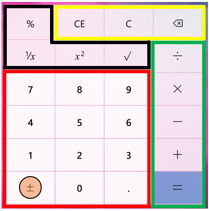
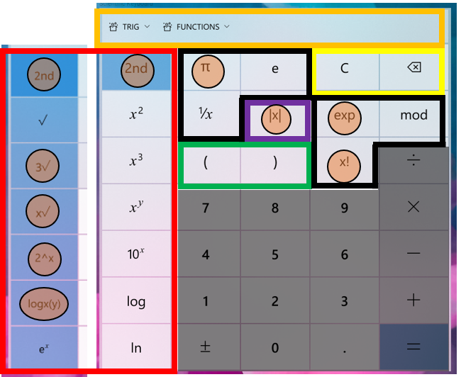

# Update Calculator keyboard for greater consistency and extensibility

## Problem Statement
The Calculator keyboard requires some changes to meet the demands of upcoming features, including graphing mode and always-on-top mode. Furthermore, the current standard keyboard could be better at accommodating scaled screen sizes, which improves overall accessibility of the app. There are a number of other problems this spec seeks to address, including reducing confusion over the up arrow used as the shift key and reducing the number of keyboard layout states.

## Evidence or User Insights
The current keyboard is not scalable to support new minimum size requirements for CompactOverlay mode, nor is it extensible to support additional functionality in graphing calculator.

## Proposal
Update they keyboard app-wide for increased consistency and greater extensibility to prepare for upcoming feature improvements.

## Goals and Non-Goals
**Goals**
* No functionality takebacks in existing calculator modes
* Opportunistically add missing functionality across modes
* Increase clarity around shifted operations

**Non-Goals**
* Changes to display option buttons are out of scope (e.g., BYTE/WORD mode in programmer calculator), unless the button is better suited to be included in the keyboard

## Success Criteria
Success here is unblocking future feature development and improving overall accessibility.

## Feature Requirements
| Priority | Requirement |
|:-:|:-|
| P1 | Keyboard in Standard mode is updated to new layout and styling |
| P1 | Keyboard in Scientific mode is updated to new layout and styling |
| P1 | Keyboard in Programmer mode is updated to new layout and styling |
| P1 | Keyboard in Converters are updated to new layout and styling |
| P1 | Create new Operator Overflow Panel and operator groupings |
| P1 | Calculator font updated with new/updated icons to support keyboard changes |
| P2 | Add support for X-Y focus keyboard navigation using arrow keys |
| P2 | Keyboard in Graphing Mode added with new layout and styling |

## Feature Details and High-Fidelity Concept

_**Note:** Strings and icons below are not final._

### Standard Mode
Standard Calculator functionality which offers basic operations and evaluates commands immediately as they are entered.

|||
|:-:|:-:|
| Before | After |

**Red Region - Number Pad**
* Standard number pad across all keyboards
* Button styling extended to sign and decimal buttons

**Green Region - Operator Pad**
* Core arithmetic operators always grouped and ordered the same across all keyboards
* “Submit” button is always bottom-right corner across all keyboards
* “Submit” button has styling applied to draw user attention

**Yellow Region - Backspace/Clear**
* Backspace and clear buttons moved to upper-right corner across all keyboards

**Black Region - Mode-specific**
* Space not used by common keyboard components are reserved for mode-specific buttons
* Like operators are grouped together, when possible

### Scientific Mode
Scientific Calculator functionality which offers expanded operations and evaluates commands using order of operations.

|||
|:-:|:-:|
| Before | After |

**Red Region - Shifted Operators**
* In supported keyboards, 2nd bar will always appear here in this grouping
* Shifted operations have visual treatment applied
* Shifted operations must either be the inverse operation or a variation of unshifted operator
* Adding cubes and cubic root buttons
* Adding 2x button
* Adding logxy button

**Yellow Region - Backspace/Clear**
* Outside of Standard mode, we combine CE and C buttons into one
* By default, “CE” will appear to allow user to clear everything
* Once there is input, “C” will appear instead to allow user to clear current input

**Green Region - Parenthesis**
* In supported keyboards, parenthesis will always appear here in this grouping

**Orange Region - Operator Groups**
* Modes with rich functionality will utilize a new operator overflow panel for easy access to sets of operators
* Operator groups are consistent between modes
* Scientific has following overflow operator groups
  * Trig (sin, cos, tan, sec, csc, cot, with hyperbolics and inverse variants)
  * Functions (abs, floor, ceil, rand, dms, deg)
* See overflow panel section for more details

**Black Region - Mode-specific**
* Space not used by common keyboard components are reserved for mode-specific buttons
* Like operators are grouped together, when possible

### Programmer Mode
Programmer Calculator functionality which offers common mathematical operations for developers including conversion between common bases.

|||
|:-:|:-:|
| Before | After |

### Converters
Conversion between many units of measurement.

|||
|:-:|:-:|
| Before | After |

### Graphing Mode (_new_)

## Appendix
<!-- Phases: For larger projects, it may be useful to break the plan into phases (e.g., crawl, walk, run). If applicable, detail that plan here. -->

<!-- Risks and Open Issues: Call out any open issues, if applicable. Waht's left to solve or agree on? -->

<!-- Resources: Include links to any additional documentation or resources, if applicable. -->
