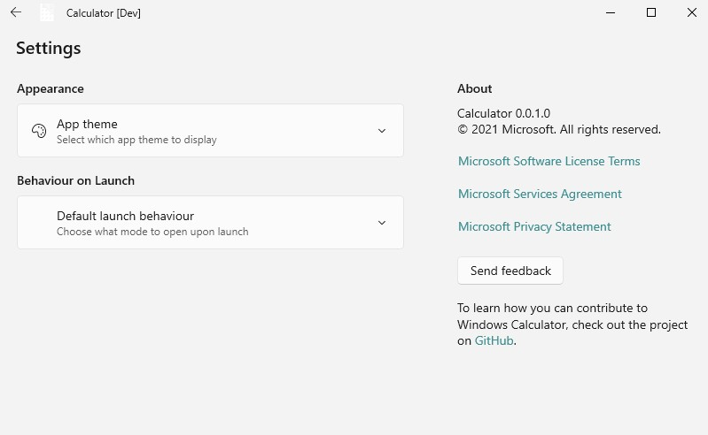
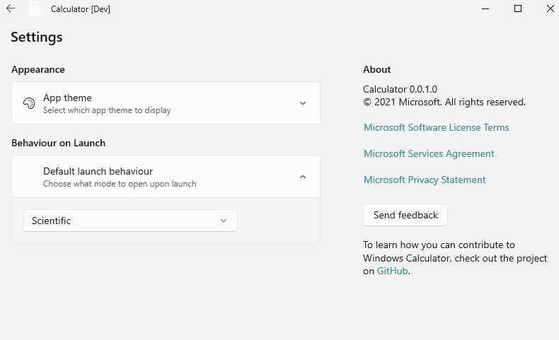
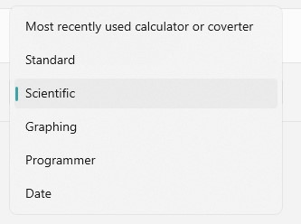
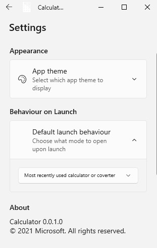

### Setting to specify what mode to use upon application's launch

### Feature Pitch Link
https://github.com/Microsoft/calculator/Issues/486

### Problem Statement
Currently, the calculator launches in whatever calculator or converter the user previously used. Some users have displayed frustration in this system, since the user has to first switch from whatever mode they last used — be it a calculator or a converter — to standard mode or scientific to do some calculations (the user that reported issue #486 reported that one needs seven clicks to do a calculation). 

### Evidence or User Insights
Github issue microsoft/calculator#486, Feedback hub issues.

### Proposal
Add a new setting in the "Settings" page, prompting the user to specify what to do upon launch. The default shall be to use the most recently used calculator or converter upon launch.

### Goals and Non-Goals
Goal: to allow the user to choose what calculator mode should be used upon launch of app.

### Feature Requirements
User can easily specify what mode the calculator should use upon launch via the setting.

### Feature Details and High-Fidelity Concept
Below are some graphics suggesting what this might look like:

*Figure 1: The "Settings" page with the new "Behaviour on Launch" section*

*Figure 2: The "Default launch behaviour" expander open*

*Figure 3: The options in the combobox*

*Figure 4: Small window view*

NOTE: these titles and descriptions are up for discussion and are subject to change.
These graphics are based on my [calculator fork's "LaunchBehaviourSpec" branch](https://github.com/Chips1234/calculator/tree/LaunchBahviourSpec)

### Appendix
Risks: I do not see any.
Phases: I don't think this requires phases to be implemented.