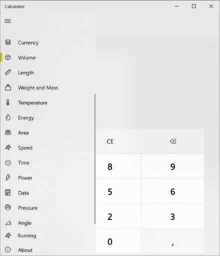

# Switching to Running coversion mode

A user who wants to use the running conversion mode, starts by opening the Home menu and selecting the last
menu item in the Conversions section which is titled "Running", has the same icon as "Speed", and its
shortcut key is Alt+RU.

