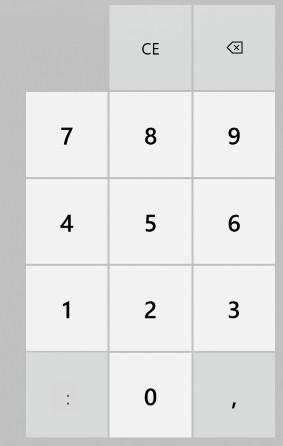

# User experience

The user experience for the Running conversion category follows the approach of all other conversion categories, showing the
numeric buttons, the clear and backspace button, and decimal separator button, as shown in the image (the image shows the comma
as the decimal separator, which is only an example; the decimal separator follows the user's culture settings).
Additionally, on the left of the "0" button, we are adding the time separator button (culture dependent),
available when any of the pace, race time, or interval time units are selected as source.
The time separator button is hidden when a speed source unit is selected. The
decimal separator button is available at all times.

Both the decimal and time separator buttons, when visible, add the respective character to the input only when this results into
a full or partial valid value of time or speed.

Valid values for speed measurements are the same as valid values of decimal numbers.
Valid values for time-based measurements are listed below. The symbol ":" is used as a placeholder for the culture dependent
time separator. \<*whole number*\> denotes a number without decimal digits, which can be prepended by the digit 0 (i.e. 5 and 05
are both valid values). \<*number*\> denotes a number with optional decimal separator and decimal digits, which also can be prepended
by the digit 0.

- \<*number*\>, interpreted as seconds (examples: "12", "45.1", "07")
- \<*whole number*\>:\<*number*\>, interpreted as minutes and seconds (examples: "01:12", "13:01,2")
- \<*whole number*\>:\<*whole number*\>:\<*number*\>, interpreted as hours, minutes, and seconds (examples: "1:45:09", "03:58:13.8")

