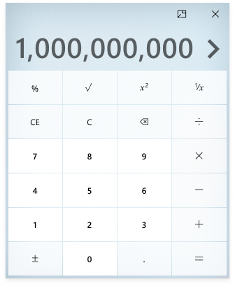

# Calculator Always-on-top

## Problem Statment
When attempting to use Calculator with another application, such as a spreadsheet, clicking on the other app (e.g. scroll, copy) moves Calculator to the background. Users want Calculator to stay on top of other apps to facilitate ongoing use with other apps. Alt-tab allows them to quickly bring Calculator back to the foreground, but their flow is interrupted.

## Evidence or User Insights
Having an always-on-top mode is the second highest (2670) customer request we have received. Without it is a substantial feature gap, and people complain about having to pay for an app which is sticky because the OS version won’t do it.

## Proposal
Create an “always-on-top” mode for Calculator. This requires making a compact view of the app for the picture-in-picture mode which supports this implementation.

## Goals
- Customer can easily switch to the always-on-top mode
- Customer can easily continue with other tasks while using Calculator always-on-top mode
- Customer can always and easily view/input into essential Calculator functions when using compact view
- Customer can easily switch back to the app’s full windowed mode when leaving always-on-top mode

## Non-goals
- Parity with the full version of the app

## User Experience
Always-on-top mode for calculator is a special mode (uses the Compact Overlay mode API) that keeps the calculator window on top of other windows regardless which window is in focus. This mode provides limited functionalities compared to the normal mode.

### Elements/functions removed from the standard mode
Only standard calculator is supported in the always-on-top mode. The following elements/functions are removed from the normal mode standard calculator in the always-on-top mode.

- Application title
- Minimize window button 
- Maximize window button
- Hamburger menu
- Calculator type title
- Previous typed number (the secondary line above the number)
- History
- Memory
- MC, MR, M+ M-, MS, M(with a down arrow)

The previously typed keys are shown in the primary number text area in the always-on-top mode. E.G. The user typed 6 + 9 and then =. Before = is pressed, 6 + 9 are shown in the primary text area. If the numbers don’t fit in the width of the window, they get pushed out of the view on the left side and an arrow is shown on the left side of the primary number text area. The user can press the arrow to scroll the numbers (the scrolling behavior is the same as that of the secondary text area in the normal mode).

> Figure 1 - Default size

> Figure 2 - Default size (left scroll arrow shown)

> Figure 3 - Hover over the chevron arrow

> Figure 4 - Default size (right scroll arrow shown)

### Keyboard shortcuts
All keyboard shortcuts for the mode other than standard are disabled in the always-on-top mode. The table below lists the standard keyboard shortcuts that are supported in the always-on-top mode.

> Note: The keyboard shortcuts only supported in the regular and max-size layouts are called out in the table.

| Shortcut | Action |
|----------|-------------|
| % | Select % |
| @ | Calculate the square root |
| q | Select x2 |
| r | Select 1/X |
| Esc | Clear all input (select C) |
| Delete | Clear current input (select CE) |
| Backspace | Delete last character |
| / | Divide |
| * | Multiply |
| - | Subtract |
| + | Add |
| F9 | Select ± |
| . | Decimal point |
| Enter | Equal |

### Window sizes & management
Window resizing is enabled in the always-on-top mode. The default window size for the always-on-top mode is 320 x 394 epx. The minimum size of the window is 150 x 150 epx. The maximum size is 500 x 500 epx or half of the screen height depending on which is smaller.

When the user shrinks the window down from the default size, the %, √, x ², 1/x keys are removed.

> Figure 5 - Min-size (150x150 epx)

> Figure 6 - Max-size (500 x 500 epx)

If the user resizes the always-on-top window, the user configured size is saved and used as the default size the next time user enters the always-on-top mode (both in the same session and in new sessions).

Window snapping is disabled in the always-on-top mode.

### Enter Always-on-top mode
Always-on-top button only shows in the standard mode. Clicking the always-on-top button   in the UI enables the always-on-top mode and places the always-on-top mode window at the upper right corner (position managed by the Compact Overlay mode API) of the screen. If another app is already in Compact overlay mode, Calculator always-on-top window is stacked on top of the other window and offset to the lower left direction to ensure that the first window is still partially visible (Compact Overlay mode API manages the positioning of the windows).

A tool tip (“Always-on-top”) is shown when mouse is hovered over the always-on-top mode button.

> Figure 7 - Always-on-top entry point

### Exit Always-on-top mode
Clicking the Exit always-on-top mode button  in the always-on-top mode exits the mode and restores the Calculator normal mode window at its last position before always-on-top mode is enabled.

When Calculator is closed from the always-on-top mode, opening it again launches it in the normal mode and positions the app window at the last position the normal mode is at.

A tool tip (“Exit always-on-top”) is shown when mouse is hovered over the exit always-on-top mode button.

## Usage metrics
Telemetries are added to answer whether the users use the always-on-top mode.

1. Number of monthly devices in which always-on-top is used/Number of all monthly active devices
2. NUmber of monthly sessions in which always-on-top is used/Number of all monthly sessions

