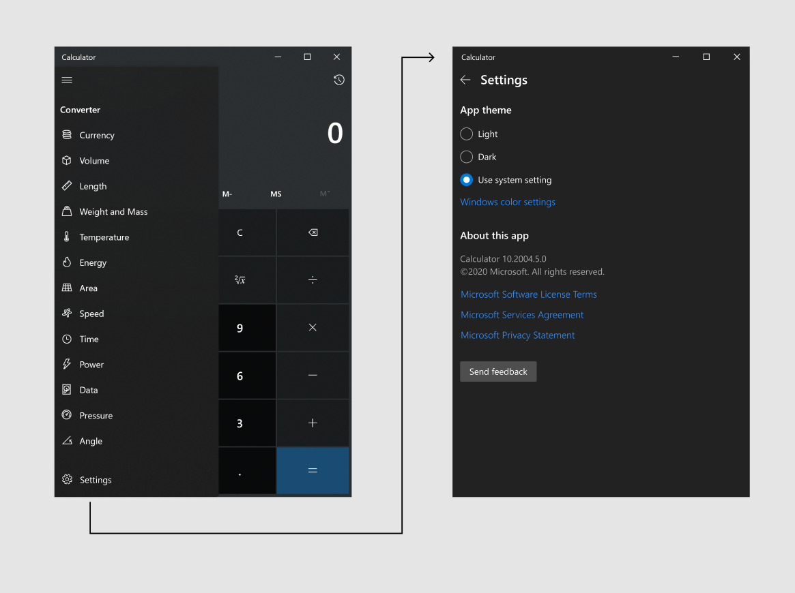
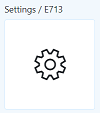
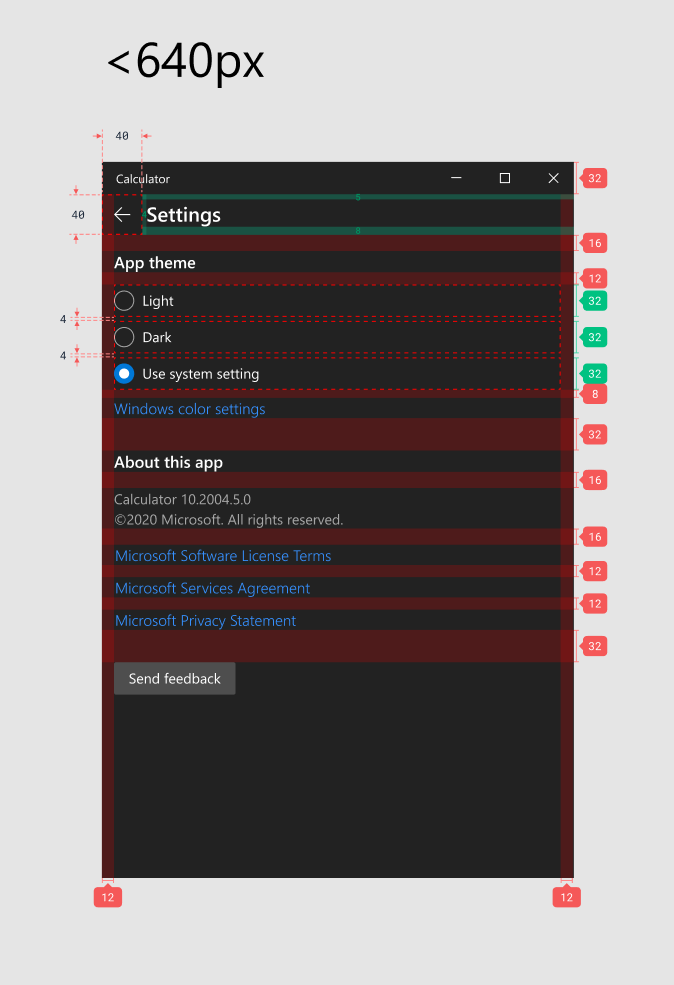
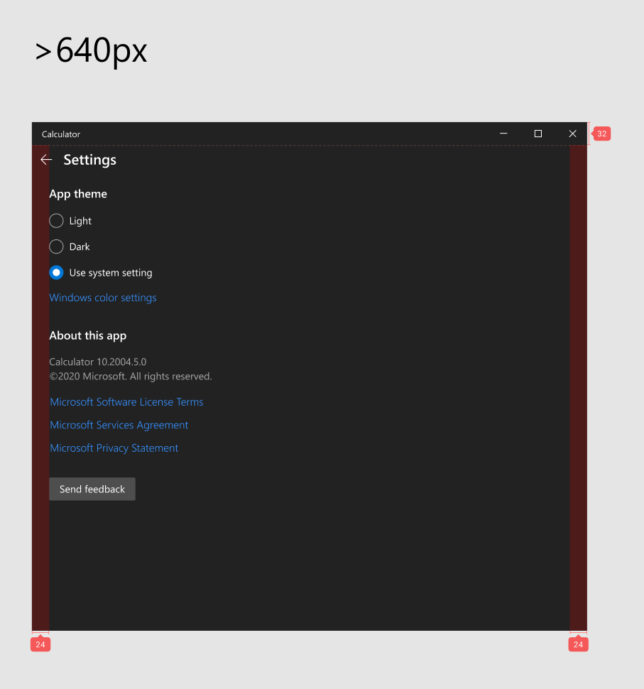

## Add Settings Page to Windows Calculator

Feature Pitch Link: https://github.com/microsoft/calculator/issues/596

### Problem Statement
Calculator currently does not have a settings page, which will block future work. The current about dialog is also inconsistent with many other Microsoft apps.

### Evidence or User Insights
Many suggested features have suggested adding options in settings (see feature pitch link for details). Without a Settings Page, we are blocked from moving forward with some of these features.

### Proposal
Replace the current "About" dialog with a Settings page consistent with other Microsoft applications and add app theme option as initial setting.

### Goals
* Replace current about dialog with settings page
* Be consistent with settings UX patterns established in other Microsoft apps
* Add basic theme selection option common across many other apps

### Non-Goals
* Add any additional options at this time.

### Feature Requirements
* Users can navigate to a new Settings page that takes up the full view.
* Users can set the current app theme.
* Users can review information about the app (e.g., version number, terms, etc.)

### Feature Details and High-Fidelity Concept

The "About" dialog entry point should be replaced with one for the new settings page. The icon is already included as part of the Calculator font:

The new "App theme" setting should be set to "Use system setting" by default and should persist accross app sessions when updated by the user. 

The "About this app" section can be adapted from the existing about dialog code and leverage the same format strings and URLs (except updating "About" to "About this app").

#### Design Details

